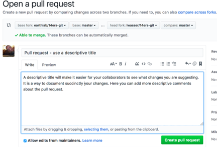
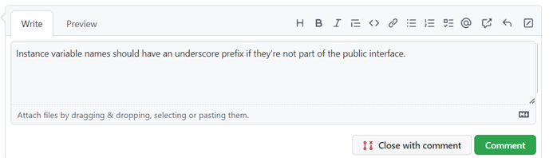

Guidelines for Code Review

1.Define the Process
There should be a clear and easy to follow process defined before beginning any code review. This process may look slightly different for other teams but must ultimately have the same result. A simple example of a defined process can be found below:

-The author of the code opens a new Pull Request, along with a short descriptive title and comment detailing the code.
 
 
-The reviewer begins to review the changes, seeing if they match the intended changes.

 

-The reviewer can spot bad practices here and comment on them.
Example:

 

 
Note: As a reviewer, make sure to direct these comments at the code, not the author

-Once changes have been made (if requested), merge the Pull Request

2.Keep Focus on the Correct Things
All software developers are different, and program differently as well, so it is important to focus on the right things when conducting a code review. As a reviewer, don’t nit pick on small unnecessary details that you may do differently. 
This doesn’t mean that you shouldn’t make helpful suggestions that will improve the code, but just make sure that such suggestions actually enhance the quality of the code, and aren’t just stylistic choices.

3.Comments & Conversation
When you make a comment as a reviewer, make sure to be as clear as possible. Many would suggest that you should over communicate in your comments, to make sure that there is no room for confusion or uncertainty. 
Be clear if a comment is just a suggestion, as it may not be a necessary requirement to change whatever it may be. But also, when asking a question for clarity or reporting a bug, make sure to be as explicit in your explaination as possible. 
One of the most frustrating things as an author can be receiving an unclear comment from a reviewer. 

4.Optimisation
There are many things you can do as an author and a reviewer to optimise the Code Review process. 

a)	As the author, the first thing you should always try to do is review your work yourself before submitting a pull request to be reviewed by your peers. This way, you can catch any small typos or mistakes here before the reviewers, thus saving time
b)	As important as it is to do code reviews efficiently, it is also extremely beneficial to do them quickly as well. Speedy code reviews can improve and increase team performance massively. 
c)	Another way to optimise the team’s code review process is by keeping pull requests small. The smaller the changes in the code, the easier it is to design, review and eventually merge.
 
All these steps are essential, but it’s important to note that the last two steps also go hand in hand; code reviews can be done quickly when pull requests are kept small.

Positive Feedback
Being reviewed by your peers can sometimes put a strain on interpersonal team relationships and even make things awkward. This is why it’s important to keep your critiques balanced with positive reviews as well. Keep in mind that there are many possible soultions to fix one problem, and that you and and your peers are in the same boat. 
Remember that authors will always appreciate receiving positive feedback from reviewers!

Be Open to Critique
Authors also need to remember to be open to critique and suggestion. Shared knowledge and expertise can strengthen your own skills as a software developer, and can make you better and more experienced.
There’s always room for improvement!

Links for further reading:
Gaper: Benefits of Code Review: Every Team Must Know [2022 Guides] - https://gaper.io/benefits-of-code-review/

Wikipedia: Code review -  https://en.wikipedia.org/wiki/Code_review

YouTube: Code Review Best Practices For Software Engineers - https://www.youtube.com/watch?v=1Ge__2Yx_XQ

Swarmia: A complete guide to code reviews - https://www.swarmia.com/blog/a-complete-guide-to-code-reviews/?utm_term=code%20review%20steps&utm_campaign=SRH-REVIEW-EU-EN&utm_source=adwords&utm_medium=ppc&hsa_acc=6644081770&hsa_cam=16463390785&hsa_grp=134848023275&hsa_ad=585675515692&hsa_src=g&hsa_tgt=kwd-816727255637&hsa_kw=code%20review%20steps&hsa_mt=p&hsa_net=adwords&hsa_ver=3&gclid=Cj0KCQjw2v-gBhC1ARIsAOQdKY1Y5VzoQQip7SV_ZN-tjrrQTFFwQxr34YFpWkRpp_19gaKrTkcVTx8aAixMEALw_wcB

Smartbear: Best Practices for Code Review - https://smartbear.com/learn/code-review/best-practices-for-peer-code-review/

 [Introduction](Introduction.md)