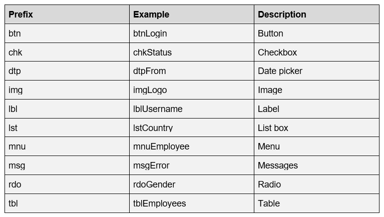

## Types of Coding Standards:

---

### **Code Formatting** : 
-	Indentation, Spacing, Line Breaks and Braces. Makes code readable and consistent.

### **Sizw** : 
-	Length of classes and methods. Functions or methods that are too long are difficult to read and maintain. Classes that are too large can be very difficult to reuse. 
-	Line length : Coding standards can define maximum line length as large length can be difficult to read or maintain.

### **Comments And Documentation** : 

-	How code is documented, makes it easier to be managed. 
-	Large code should have comments, so new developers can understand what is happening. Explains purpose of code and what it’s meant to do.

 

### **Naming** : 

-	How variables, methods and classes are named. Helps code to be more readable and understandable. 
-	Meaningful naming, should be descriptive. Behaviour should be seen in the name.
-	Should be consistent throughout project.

---

### Pages
- [Introduction](Introduction.md)
- [Benefits](Benefits.md)
- [Bad Practices](Introduction.md)
