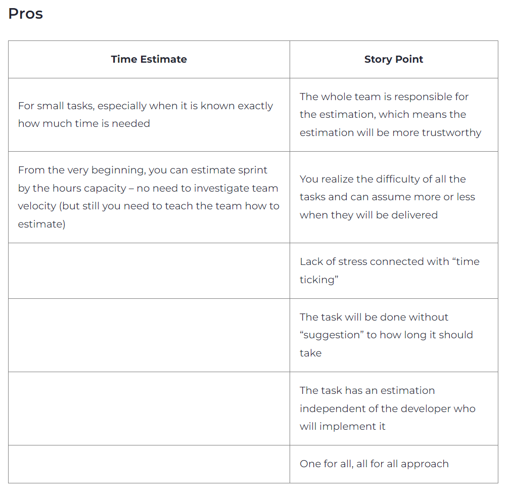
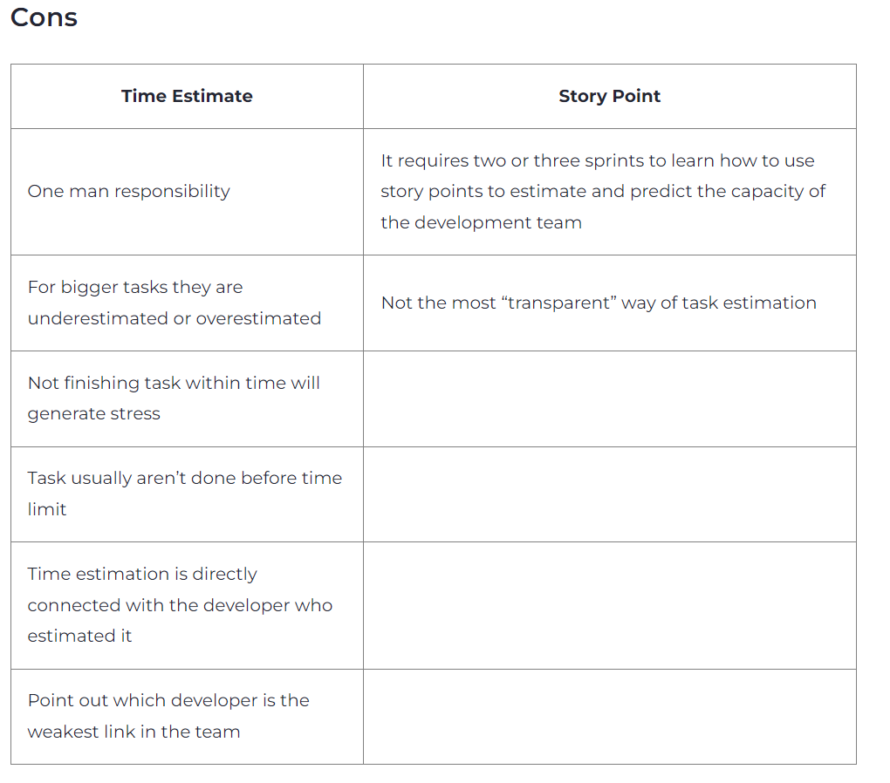
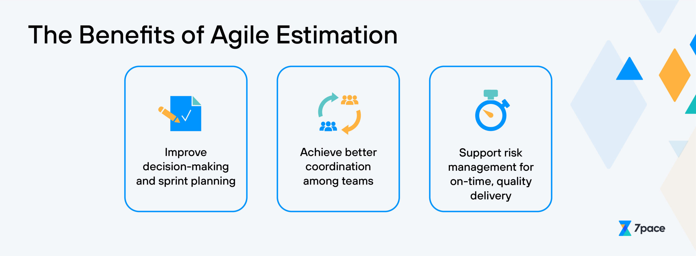
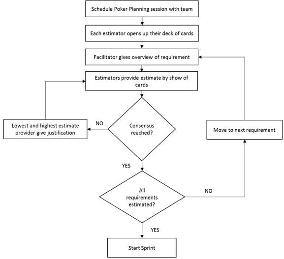

### Task Estimation

---

### Task Estimation Introduction

Task Estimation can be defined as a technique of calculating the time needed to finish a particular job or user story in a Scrum project. 

---

### *Process* : 

- A) The team evaluates the user stories in the product backlog and determines the tasks required to solve them during the sprint planning meeting,
during which task estimate is typically done.

- B) The team then determines how much work will be needed for each assignment, typically in hours or story points. Instead of being an exact 
time measurement, story points are a relative indicator of how difficult and time-consuming an activity is to perform. The actual effort
needed to complete a work may differ from the first estimate since task estimation is not an exact science.

### *Benefits* : 

- It is an agile framework that places a focus on team members' collaboration and communication. 
- The comparison of various tasks. Story Points' judgment is subjective. 
- It considers potential risks and uncertainties in the specifications.
- The entire team participates (not just the tech lead or PM). Estimation is unbiased and independent of the person performing the work.
- It is a crucial component of Scrum, assisting teams in task planning and customer value delivery.
- The team can prioritize the work that needs to be done based on its level of effort and priority using this estimation to better 
understand their capacity for the forthcoming sprint.

---

### Story Points 
 
The two distinct methods of estimating jobs and stories are Task Estimates and Story Points.
Nevertheless, they cannot be substituted for one another. For your project and your development team, one or the other may actually be more 
advantageous. Story points are a relative measure of complexity, while time estimates are an absolute measure of effort. Both have their 
advantages and disadvantages, and it's essential to choose the right approach for your team's needs.
 
 

 
 ---
 
### *Process* : 

- A) Select a prior tale to use as a guide. If, for instance, you chose base stories with values of two and five, the team can come up with a 
new value of three because the job being estimated is greater than the story with a value of two but less than the value of five.

- B) To see the values of the narrative points, create a matrix. For each number in the Fibonacci pattern, create a row.

- C) Put your story elements in the appropriate row after giving them values.

- D) Play planning poker with narrative points.

- E) Teams can give values to story points using playing cards to represent the numbers on the Agile Fibonacci sequence 
using this Scrum estimation method. 

- F) Team members choose the card they believe best depicts the value for the story 
after discussing upcoming user stories. The story is given that number if everyone selects the same one. If even 
one team member picks a different figure, the story is further discussed until everyone agrees.

### *Benefits* : 

-	It can handle challenging or massive tasks: These kinds of stories are difficult to predict over time due to unpredictability,
    as was already explained. Real risks (or uncertainty) are incorporated into the estimation in story points.
-	It permits various strengths: Members of the development team differ in their levels of experience and competence.
    Given that this is the case, they will work at different speeds; developer A might take a lot longer to construct a software than
    developer B, therefore a time estimate that was agreed upon by both developers is useless. But with story points, it's possible to
    come to an agreement that takes into account the requirements of both developers.
-	For long-term planning, use story points, and for short-term planning, use time estimations.
-	Story points and time are not directly comparable; therefore, they should not be compared.
-	Anchor your story point scale with reference stories to maintain consistency.
-	Include everyone on the team in the estimation process to ensure there is consensus.
-	Avoid using estimating as a performance indicator or holding members of the team responsible for incorrect estimates.

--- 

### Planning Poker 

Task estimates in Scrum are often made using a method called Planning Poker. 

---

---

In order to assign relative estimates to user stories, 
the team uses a deck of cards. Teams can identify potential hazards and come to a shared understanding of the complexity of user 
stories with the use of this technique. Estimates for this method are scalable and based on team velocity. Due to the fact that 
we get estimates directly from the people who will be working on the task and are therefore more realistic, Planning Poker is 
also highly successful.
Without consulting the team or settling on the technical details, the project manager may inadvertently endanger the undertaking 
by making assumptions or missing important elements.
However, due to a number of reasons, such as ambiguity in the requirements, a lack of domain expertise, and the complexity of 
the task, effective task estimating can be difficult. 

### *Benefits* : 

• To promote conversation and debate, play planning poker in a casual, group setting.
• To promote transparency, encourage team members to discuss their projections and presumptions.
• To maintain uniformity, use reference stories and a standardized story point system.
• Play planning poker as a discussion tool rather than in place of analysis and design.
• Avoid letting planning poker become into a laborious task or a point of contention.

---

### *Reference Resources* : 

1.	[Agile Estimating and Planning by Mike Cohn](https://www.mountaingoatsoftware.com/books/agile-estimating-and-planning)		
2.	[Why I prefer Story Points to Hours by Johanna Rothman](https://www.jrothman.com/mpd/agile/2011/03/why-i-prefer-story-points-to-hours/)
3.	[The Great Estimation Debate: Story Points vs. Hours by Ian Mitchell](https://www.agilealliance.org/resources/articles/the-great-estimation-debate-story-points-vs-hours/)
4.	[Story Points or Time? The Ultimate Test by Chris Matts](https://www.chrismatts.com/blog/story-points-or-time-the-ultimate-test/)
5.	[The Trouble with Time by Ron Jeffries](https://ronjeffries.com/articles/estimation-articles/trouble-with-time/)
6.	[Agile Estimating and Planning Poker by Mountain Goat Software](https://www.mountaingoatsoftware.com/agile/planning-poker)
7.	[Planning Poker: A Powerful Estimation Technique for Teams by Agile Alliance](https://www.agilealliance.org/resources/videos/planning-poker-a-powerful-estimation-technique-for-teams/)
8.	[The Rituals of Agile Est](https://liuhongbo.medium.com/tips-for-effective-task-estimation-in-scrum-planning-meetings-c7a6af2c4966)
9.	[Estimation Tips](https://statushero.com/blog/scrum-estimation-tips-for-improving-engineering-estimates/#:~:text=Estimates%20give%20a%20general%20idea,sprints%20of%20approximately%20two%20weeks)
10.	[Planning Poker](https://www.softwaretestinghelp.com/planning-poker-scrum-poker-cards-agile-estimation/)
11.	[Story Points](https://www.atlassian.com/agile/project-management/estimation)